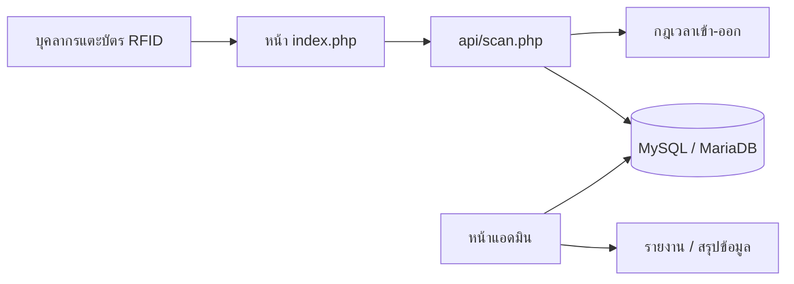
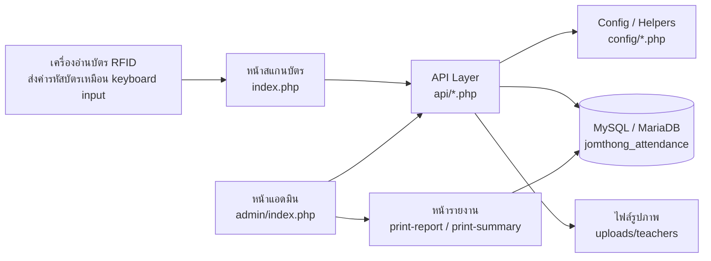
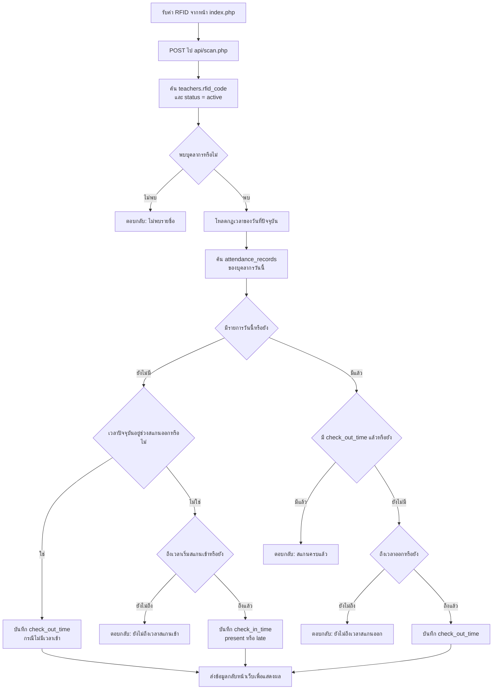
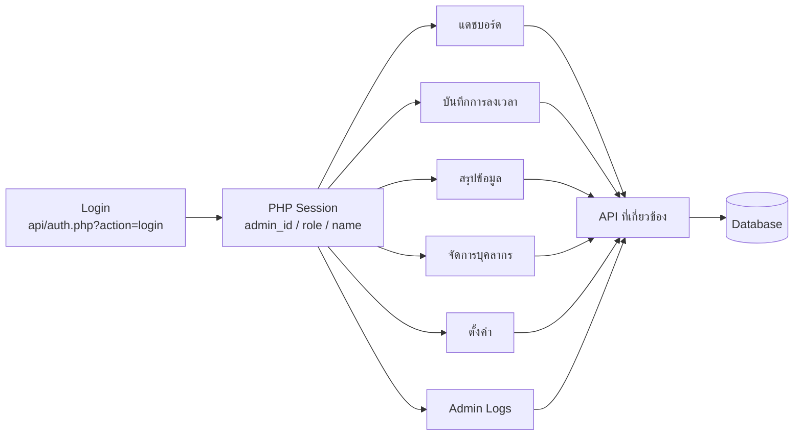
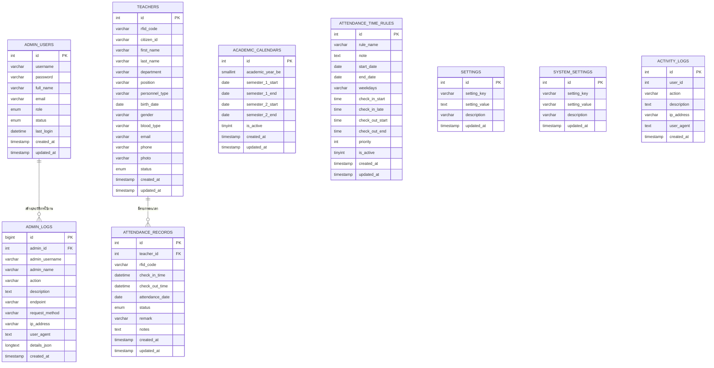

# 📘 คู่มือระบบลงเวลาราชการ ข้าราชการครูและบุคลากร โรงเรียนจอมทอง

เอกสารฉบับนี้จัดทำขึ้นเพื่อใช้เป็นคู่มือประกอบการติดตั้ง ดูแลระบบ และใช้งานระบบลงเวลาราชการด้วยบัตร RFID ของโรงเรียนจอมทอง โดยอธิบายภาพรวมระบบ ขั้นตอนใช้งาน โครงสร้างไฟล์ ฐานข้อมูล API สำคัญ และแนวทางดูแลหลังนำขึ้นโฮสต์

## 🏫 ข้อมูลโครงการ

| รายการ | รายละเอียด |
| --- | --- |
| ชื่อระบบ | ระบบลงเวลาราชการ ข้าราชการครูและบุคลากร โรงเรียนจอมทอง |
| ผู้พัฒนา | นายชลนที บุญทา |
| ประเภทระบบ | เว็บแอปพลิเคชันสำหรับลงเวลาเข้า-ออกด้วยบัตร RFID |
| กลุ่มผู้ใช้งาน | ข้าราชการครู บุคลากร และผู้ดูแลระบบ |
| สถานศึกษา | โรงเรียนจอมทอง |

## 🧰 เทคโนโลยีที่ใช้

| ส่วนของระบบ | เทคโนโลยี |
| --- | --- |
| Backend | PHP 8.x แบบไม่ใช้ framework |
| Database | MySQL / MariaDB |
| Database Access | PDO MySQL |
| Frontend | HTML, CSS, JavaScript |
| UI Framework | Tailwind CSS |
| Icon | Font Awesome |
| Font | Noto Sans Thai, Sarabun |
| Web Server | Apache / XAMPP หรือ hosting ที่รองรับ PHP |
| File Upload | PHP upload/base64 image processing สำหรับรูปบุคลากร |
| Authentication | PHP Session และ password hash |
| Report | HTML print stylesheet ผ่าน browser print |
| Data Format | JSON API |
| Timezone | Asia/Bangkok |

## 🌐 1. ภาพรวมของระบบ

ระบบนี้เป็นเว็บแอปพลิเคชัน PHP + MySQL/MariaDB สำหรับบันทึกเวลาเข้า-ออกงานของข้าราชการครูและบุคลากรด้วยบัตร RFID พร้อมหน้าแอดมินสำหรับตรวจสอบ แก้ไข และสรุปรายงาน

ฟังก์ชันหลักของระบบ:

- สแกนบัตร RFID เพื่อบันทึกเวลาเข้าและเวลาออก
- แสดงผลการสแกนล่าสุดบนหน้าสแกน
- ตรวจสถานะมาตรงเวลา มาสาย ขาด ไม่สแกนออก และกรณีสแกนออกโดยไม่มีเวลาเข้า
- ตั้งค่ากฎเวลาเข้า-ออกตามช่วงวันที่ วันในสัปดาห์ และลำดับความสำคัญ
- จัดการข้อมูลบุคลากร รูปภาพ กลุ่มสาระ/แผนก และสถานะใช้งาน
- ดูบันทึกการลงเวลารายวัน พร้อมค้นหา กรอง และแบ่งหน้า
- เพิ่ม/แก้ไขเวลาเข้า-ออกและหมายเหตุโดยผู้ดูแล
- แก้ไขเวลาหรือหมายเหตุแบบหลายรายการ
- สรุปข้อมูลตามช่วงวันที่ ปีการศึกษา ภาคเรียน กลุ่มสาระ/แผนก และรายบุคคล
- พิมพ์รายงานรายวันและรายงานสรุป
- จัดเก็บประวัติการใช้งานของแอดมิน
- จัดการปีการศึกษาและภาคเรียน

## 🎯 2. เป้าหมายของระบบ

ระบบนี้ถูกออกแบบมาเพื่อแก้ปัญหาหลัก 5 เรื่อง

1. ลดการลงเวลาแบบกระดาษและการรวบรวมข้อมูลซ้ำ
2. ให้เจ้าหน้าที่เห็นข้อมูลการมา-กลับของบุคลากรแบบทันที
3. ลดความผิดพลาดจากการคำนวณสถานะมาสาย ขาด หรือไม่สแกนออกด้วยมือ
4. รองรับการแก้ไขข้อมูลย้อนหลังพร้อมเก็บร่องรอยการดำเนินการ
5. สร้างรายงานสำหรับตรวจสอบและพิมพ์ใช้งานภายในสถานศึกษา

## 👥 3. บทบาทผู้ใช้งาน

ระบบมีบทบาทผู้ใช้งานในตาราง `admin_users.role`

### 👑 3.1 ผู้ดูแลระบบหลัก `super_admin`

สิทธิ์หลัก:

- เข้าสู่หน้าแอดมิน
- ดูและจัดการข้อมูลบุคลากร
- เห็นและแก้ไขรหัส RFID แบบเต็ม
- เพิ่ม แก้ไข ลบ หรือเปิดใช้งานปีการศึกษา
- เพิ่ม แก้ไข ลบ กฎเวลาเข้า-ออก
- ดูประวัติการใช้งานแอดมิน
- พิมพ์รายงานและดูสรุปข้อมูลทุกส่วน

### 🛡️ 3.2 ผู้ดูแลระบบ `admin`

สิทธิ์หลัก:

- เข้าสู่หน้าแอดมิน
- ดูและจัดการข้อมูลบุคลากร
- แก้ไข RFID ได้ แต่ระบบปิดบังค่าบางส่วนในบางมุมมอง
- ดูและแก้ไขบันทึกการลงเวลา
- พิมพ์รายงานและดูสรุปข้อมูล

### 👁️ 3.3 ผู้ดูข้อมูล `viewer`

สิทธิ์หลัก:

- เข้าสู่หน้าแอดมินเพื่อดูข้อมูล
- ดูข้อมูลการลงเวลาและรายงาน
- ไม่ควรใช้สำหรับงานจัดการข้อมูลสำคัญ เช่น RFID หรือการตั้งค่าระบบ

หมายเหตุ: สิทธิ์บางส่วนถูกควบคุมทั้งฝั่งหน้าเว็บและ API ดังนั้นหากต้องการเพิ่มบทบาทหรือปรับสิทธิ์ ควรตรวจที่ `config/config.php`, `api/teachers.php`, `api/settings.php` และ JavaScript ใน `admin/js/app.js` ร่วมกัน

## 🗺️ 4. หน้าใช้งานหลัก

### 🪪 4.1 หน้าสแกนบัตร

- `/index.php`
- ใช้สำหรับเปิดค้างไว้ที่จุดสแกนบัตร
- รับค่า RFID แล้วส่งไปที่ `api/scan.php`
- แสดงชื่อ รูปภาพ กลุ่มสาระ/แผนก สถานะ และเวลาที่บันทึก
- แสดงรายการสแกนล่าสุดจาก `api/recent-scans.php`

### 🖥️ 4.2 หน้าแอดมิน

- `/admin/index.php`
- มีแท็บหลัก:
  - แดชบอร์ด
  - บันทึกการลงเวลา
  - สรุปข้อมูล
  - จัดการบุคลากร
  - การตั้งค่า

### 4.3 หน้าประวัติการใช้งาน

- `/admin/logs.php`
- แสดงประวัติการทำงานของแอดมินจาก `admin_logs`
- รองรับการค้นหา กรองเหตุการณ์ และกรองช่วงวันที่

### 4.4 หน้าประวัติการสแกน

- `/admin/activity-logs.php`
- แสดงรายการจาก `activity_logs`
- ใช้ตรวจสอบเหตุการณ์การลงเวลาเข้า-ออก

### 🖨️ 4.5 หน้าพิมพ์รายงาน

- `/admin/print-report.php`
- พิมพ์รายงานการลงเวลารายวัน

- `/admin/print-summary-report.php`
- พิมพ์รายงานสรุปตามช่วงวันที่
- รองรับตัวกรองคำค้นและกลุ่มสาระ/แผนก

### 4.6 หน้านำเข้าข้อมูล

- `/admin/import-personnel.php`
- ใช้ช่วยนำเข้าหรือเตรียมข้อมูลบุคลากรตามรูปแบบที่ระบบรองรับ

## 🔄 5. ขั้นตอนการใช้งานประจำวัน

### ✅ 5.1 การสแกนเข้างาน

1. เปิดหน้า `/index.php`
2. ให้บุคลากรแตะบัตร RFID กับเครื่องอ่าน
3. ระบบค้นหาบุคลากรจาก `teachers.rfid_code` และต้องมี `status = active`
4. ถ้ายังไม่มีรายการของวันนั้น ระบบจะบันทึก `check_in_time`
5. ระบบประเมินสถานะจากกฎเวลา:
   - ก่อนหรือเท่ากับเวลาเริ่มมาสาย = มาตรงเวลา
   - หลังเวลาเริ่มมาสาย = มาสาย
6. ระบบแสดงผลการบันทึกบนหน้าจอ

### 🚪 5.2 การสแกนออกงาน

1. แตะบัตร RFID อีกครั้งในวันเดียวกัน
2. ถ้ามีเวลาเข้าแล้วและยังไม่มีเวลาออก ระบบจะตรวจช่วงเวลาสแกนออก
3. ถ้าถึงเวลาสแกนออกแล้ว ระบบบันทึก `check_out_time`
4. ถ้าสแกนก่อนเวลาออก ระบบแจ้งว่ายังไม่ถึงเวลาสแกนออก
5. ถ้าบันทึกครบแล้ว ระบบแจ้งว่าได้สแกนครบเข้า-ออกแล้ว

### ⚠️ 5.3 กรณีพิเศษ

- ถ้าสแกนครั้งแรกในช่วงเวลาออก ระบบบันทึกเป็นสแกนออกโดยไม่มีเวลาเข้า
- ถ้าไม่สแกนออก ระบบมีฟังก์ชัน `autoMarkMissingCheckOut()` ช่วยปรับสถานะเป็น `incomplete` ตามเงื่อนไขของวัน
- หมายเหตุ `ขออนุญาตมาสาย` ทำให้รายการที่มาหลังเวลาไม่ถูกจัดเป็นมาสายในสรุป
- หมายเหตุที่มีคำว่า `ลา` จะถูกจัดกลุ่มเป็นหมวดลาในรายงานสรุป

## 🛠️ 6. การใช้งานหน้าแอดมิน

### 🔐 6.1 เข้าสู่ระบบ

1. เข้า `/admin/index.php`
2. กรอกชื่อผู้ใช้และรหัสผ่าน
3. ระบบตรวจบัญชีจากตาราง `admin_users`
4. ถ้าเข้าสู่ระบบสำเร็จ ระบบบันทึก `last_login` และเขียน log การเข้าสู่ระบบ

ระบบรองรับรหัสผ่าน 2 แบบ:

- password hash จาก `password_hash()`
- plain text legacy เฉพาะกรณีข้อมูลเก่า เมื่อ login สำเร็จระบบจะอัปเกรดเป็น hash ให้อัตโนมัติ

### 📊 6.2 แดชบอร์ด

ใช้ดูภาพรวมของวันที่เลือก เช่น จำนวนบุคลากรทั้งหมด จำนวนผู้ลงเวลา มาตรงเวลา มาสาย ขาด ไม่สแกนออก และมีหมายเหตุ

### 🧾 6.3 บันทึกการลงเวลา

ใช้ตรวจสอบข้อมูลรายวัน โดยรองรับ:

- เลือกวันที่
- ค้นหาชื่อ เลขประจำตัว หรือ RFID ตามสิทธิ์
- กรองกลุ่มสาระ/แผนก
- กรองสถานะ
- แก้ไขเวลาเข้า-ออก
- เพิ่มหรือแก้ไขหมายเหตุ
- แก้ไขหลายรายการพร้อมกัน
- พิมพ์รายงานรายวัน

### 📈 6.4 สรุปข้อมูล

ใช้สรุปข้อมูลตามช่วงวันที่ โดยรองรับ:

- วันนี้
- สัปดาห์นี้
- เดือนนี้
- ปีนี้
- ปีการศึกษา/ภาคเรียนที่ตั้งค่าไว้
- ช่วงวันที่กำหนดเอง
- กรองกลุ่มสาระ/แผนก
- ค้นหารายชื่อ
- คลิกตัวเลขแต่ละหมวดเพื่อดูรายละเอียดรายวันของบุคลากรคนนั้น
- พิมพ์รายงานสรุป

หมวดในรายงานสรุป:

- มาตรงเวลา
- มาสาย
- ลา
- ขาด
- อื่น ๆ
- รวม

### 👤 6.5 จัดการบุคลากร

ใช้เพิ่ม แก้ไข และตรวจสอบข้อมูลบุคลากร ประกอบด้วย:

- RFID
- เลขประจำตัวหรือ Passport
- ชื่อ-นามสกุล
- กลุ่มสาระ/แผนก
- ตำแหน่ง
- ประเภทบุคลากร
- วันเกิด
- เพศ
- หมู่เลือด
- อีเมล
- เบอร์โทร
- รูปภาพ
- สถานะใช้งาน

เงื่อนไขสำคัญ:

- `rfid_code` ห้ามซ้ำ
- `citizen_id` หรือเลขประจำตัว/Passport ห้ามซ้ำ
- บุคลากรที่ใช้สแกนได้ต้องมี `status = active`
- ผู้ใช้ที่ไม่ใช่ `super_admin` จะไม่เห็น RFID เต็มในบางจุด

### ⚙️ 6.6 การตั้งค่า

ใช้ตั้งค่าระบบ 2 ส่วนหลัก

ปีการศึกษา:

- เพิ่มปีการศึกษา
- กำหนดช่วงภาคเรียนที่ 1 และ 2
- เลือกปีการศึกษาที่ใช้งาน
- ระบบซิงก์ข้อมูลไปยัง `settings` เพื่อรองรับโค้ดเก่า

กฎเวลาเข้า-ออก:

- ตั้งชื่อกฎเวลา
- กำหนดช่วงวันที่
- กำหนดวันในสัปดาห์
- ตั้งเวลาเริ่มสแกนเข้า
- ตั้งเวลาเริ่มมาสาย
- ตั้งเวลาเริ่มสแกนออก
- ตั้งเวลาสิ้นสุดสแกนออก
- ตั้งลำดับความสำคัญ
- เปิด/ปิดใช้งานกฎ

กฎเวลาที่มีช่วงวันที่เฉพาะและ priority สูงกว่าจะถูกนำมาใช้ก่อน เมื่อวันที่ใช้งานตรงกับเงื่อนไข

## 🏷️ 7. สถานะการลงเวลา

ระบบเก็บสถานะหลักใน `attendance_records.status`

| ค่า | ความหมาย |
| --- | --- |
| `present` | มาตรงเวลา |
| `late` | มาสาย |
| `absent` | ขาด หรือไม่มีเวลาเข้า |
| `incomplete` | มีเวลาเข้าแต่ไม่สแกนออก |

นอกจากสถานะหลัก ระบบยังคำนวณสถานะแสดงผลผ่าน `resolveAttendanceDisplayStatus()` เช่น:

- `present` = มาตรงเวลา
- `late` = มาสาย
- `on_time_checked_out` = มาตรงเวลา กลับตรงเวลา
- `late_checked_out` = มาสาย กลับตรงเวลา
- `on_time_no_check_out` = มาตรงเวลา ไม่สแกนออก
- `late_no_check_out` = มาสาย ไม่สแกนออก
- `no_check_in_but_checked_out` = ไม่สแกนเข้า แต่สแกนออก
- `absent` = ยังไม่ลงเวลา หรือขาด

## 🧱 8. โครงสร้างระบบ

ระบบเป็น PHP application แบบไม่ใช้ framework โดยแบ่งไฟล์หลักดังนี้

```text
hrscan/
├── index.php                         # หน้าสแกนบัตร RFID
├── admin/
│   ├── index.php                     # หน้าแอดมินหลัก
│   ├── logs.php                      # ประวัติการใช้งานแอดมิน
│   ├── activity-logs.php             # ประวัติ activity logs
│   ├── print-report.php              # รายงานรายวัน
│   ├── print-summary-report.php      # รายงานสรุปช่วงวันที่
│   ├── import-personnel.php          # หน้านำเข้าข้อมูลบุคลากร
│   ├── run-db-migration.php          # ตัวช่วย migration
│   └── js/
│       ├── app.js                    # JavaScript หลักของหน้าแอดมิน
│       ├── logs.js                   # JavaScript หน้า admin logs
│       └── activity-logs.js          # JavaScript หน้า activity logs
├── api/
│   ├── auth.php                      # login/logout/check session
│   ├── scan.php                      # รับ RFID และบันทึกเวลา
│   ├── recent-scans.php              # รายการสแกนล่าสุด
│   ├── attendance.php                # รายการ/สถิติ/รายละเอียดการลงเวลา
│   ├── summary-report.php            # สรุปรายบุคคลตามช่วงวันที่
│   ├── teachers.php                  # จัดการบุคลากร
│   ├── settings.php                  # ปีการศึกษาและกฎเวลา
│   ├── upload-photo.php              # อัปโหลดรูปบุคลากร
│   ├── delete-photo.php              # ลบรูปบุคลากร
│   ├── update-attendance-time.php    # แก้ไขเวลาเข้า-ออก
│   ├── update-attendance-remark.php  # แก้ไขหมายเหตุ
│   ├── create-attendance-record.php  # เพิ่มรายการลงเวลา
│   ├── admin-logs.php                # API ประวัติแอดมิน
│   └── activity-logs.php             # API activity logs
├── config/
│   ├── database.php                  # เชื่อมต่อฐานข้อมูลผ่าน PDO
│   ├── config.php                    # helper, constants, rules, JSON response
│   └── environment.php               # ค่า default แยก local/production
├── database/
│   └── schema.sql                    # SQL โครงสร้างฐานข้อมูลแบบไม่มีข้อมูลจริง
├── assets/
│   └── images/logo.png               # โลโก้โรงเรียน
└── uploads/
    └── teachers/                     # รูปภาพบุคลากร
```

## 🏗️ 9. โครงสร้างการทำงานระดับสูง



## 🗄️ 10. ตารางฐานข้อมูลหลัก

### 10.1 `teachers`

เก็บข้อมูลบุคลากรและ RFID

ฟิลด์สำคัญ:

- `id`
- `rfid_code`
- `citizen_id`
- `first_name`
- `last_name`
- `department`
- `position`
- `personnel_type`
- `birth_date`
- `gender`
- `blood_type`
- `email`
- `phone`
- `photo`
- `status`

### 10.2 `attendance_records`

เก็บรายการลงเวลาเข้า-ออก

ฟิลด์สำคัญ:

- `id`
- `teacher_id`
- `rfid_code`
- `check_in_time`
- `check_out_time`
- `attendance_date`
- `status`
- `remark`
- `notes`

### 10.3 `admin_users`

เก็บบัญชีผู้ดูแลระบบ

ฟิลด์สำคัญ:

- `username`
- `password`
- `full_name`
- `email`
- `role`
- `status`
- `last_login`

### 10.4 `academic_calendars`

เก็บปีการศึกษาและช่วงภาคเรียน

### 10.5 `attendance_time_rules`

เก็บกฎเวลาเข้า-ออกแบบยืดหยุ่น

### 10.6 `admin_logs`

เก็บประวัติการทำงานของแอดมิน เช่น login, logout, เพิ่ม/แก้ไขบุคลากร, ตั้งค่าระบบ

### 10.7 `activity_logs`

เก็บเหตุการณ์กิจกรรมทั่วไปของระบบ

### 10.8 `settings` และ `system_settings`

เก็บค่าเดิมของระบบและใช้สำหรับ compatibility กับโค้ดบางส่วน

## 🔌 11. API สำคัญ

API ทั้งหมดตอบกลับเป็น JSON ผ่าน `jsonResponse()` และ API ฝั่งแอดมินส่วนใหญ่ต้องมี session login

| Endpoint | หน้าที่ |
| --- | --- |
| `api/auth.php?action=login` | เข้าสู่ระบบแอดมิน |
| `api/auth.php?action=logout` | ออกจากระบบ |
| `api/auth.php?action=check` | ตรวจ session |
| `api/scan.php` | รับ RFID และบันทึกเวลาเข้า-ออก |
| `api/recent-scans.php` | ดึงรายการสแกนล่าสุด |
| `api/attendance.php?action=list` | ดึงรายการลงเวลารายวัน |
| `api/attendance.php?action=stats` | ดึงสถิติรายวัน |
| `api/attendance.php?action=departments` | ดึงรายชื่อกลุ่มสาระ/แผนก |
| `api/attendance.php?action=get&id=...` | ดึงรายละเอียดรายการลงเวลา |
| `api/summary-report.php` | ดึงสรุปตามช่วงวันที่ |
| `api/teachers.php?action=list` | ดึงรายการบุคลากร |
| `api/teachers.php?action=get&id=...` | ดึงข้อมูลบุคลากรรายคน |
| `api/teachers.php?action=create` | เพิ่มบุคลากร |
| `api/teachers.php?action=update&id=...` | แก้ไขบุคลากร |
| `api/settings.php?action=get` | ดึงปีการศึกษาและกฎเวลา |
| `api/settings.php?action=save_calendar` | บันทึกปีการศึกษา |
| `api/settings.php?action=set_active_calendar` | เลือกปีการศึกษาที่ใช้งาน |
| `api/settings.php?action=save_time_rule` | บันทึกกฎเวลา |
| `api/settings.php?action=delete_time_rule` | ลบกฎเวลา |
| `api/admin-logs.php` | ดึงประวัติแอดมิน |
| `api/activity-logs.php` | ดึง activity logs |

## 💻 12. การติดตั้งบนเครื่อง local

### 12.1 ความต้องการระบบ

- PHP 8.x
- MySQL หรือ MariaDB
- Web server เช่น Apache
- PDO MySQL extension
- Browser รุ่นใหม่

ระบบนี้ถูกวางในโครงสร้าง XAMPP ได้ เช่น:

```text
/Applications/XAMPP/xamppfiles/htdocs/hrscan
```

### 12.2 สร้างฐานข้อมูล

1. เปิด phpMyAdmin หรือ MySQL client
2. สร้างฐานข้อมูล

```sql
CREATE DATABASE jomthong_attendance CHARACTER SET utf8mb4 COLLATE utf8mb4_unicode_ci;
```

3. Import ไฟล์

```text
database/schema.sql
```

### 12.3 ตั้งค่าการเชื่อมต่อฐานข้อมูล

ระบบอ่านค่าจาก environment variables ก่อน ถ้าไม่มีจะใช้ default ใน `config/environment.php`

ค่าที่รองรับ:

```text
DB_HOST
DB_NAME
DB_USER
DB_PASS
DB_CHARSET
APP_BASE_URL
```

ตัวอย่างสำหรับ local:

```text
DB_HOST=localhost
DB_NAME=jomthong_attendance
DB_USER=root
DB_PASS=
DB_CHARSET=utf8mb4
APP_BASE_URL=http://localhost/hrscan
```

ข้อควรระวัง: ห้ามใส่รหัสผ่านฐานข้อมูล production ลงใน README หรือ commit ขึ้น repository สาธารณะ ควรกำหนดผ่าน environment variables หรือ configuration ของโฮสต์

### 12.4 เปิดใช้งาน

เปิดผ่าน browser:

```text
http://localhost/hrscan/
http://localhost/hrscan/admin/
```

## 🚀 13. การ deploy ขึ้นโฮสต์

ไฟล์และโฟลเดอร์ที่ควรอัปโหลด:

- `index.php`
- `admin/`
- `api/`
- `assets/`
- `config/`
- `database/schema.sql` เฉพาะกรณีต้องการเก็บ SQL โครงสร้างฐานข้อมูลบนโฮสต์
- `uploads/` และต้องให้ web server เขียนไฟล์ได้
- `.htaccess`

สิ่งที่ต้องตรวจหลัง deploy:

1. ฐานข้อมูลถูกสร้างและ import แล้ว
2. ค่า `DB_HOST`, `DB_NAME`, `DB_USER`, `DB_PASS` ถูกต้อง
3. โฟลเดอร์ `uploads/teachers/` เขียนไฟล์ได้
4. เวลา server ตรงกับ timezone Asia/Bangkok หรือระบบ PHP ตั้งค่าไว้แล้ว
5. เปิด `/admin/index.php` แล้ว login ได้
6. เปิด `/index.php` แล้วสแกนหรือกรอก RFID ได้
7. ทดสอบพิมพ์รายงานรายวันและรายงานสรุป

## 👤 14. การดูแลข้อมูลบุคลากร

แนวทางแนะนำ:

- ตรวจ `rfid_code` ให้ตรงกับเลขที่เครื่องอ่านส่งมา
- ตั้งสถานะ `active` เฉพาะบุคลากรที่ต้องใช้งานจริง
- ใช้กลุ่มสาระ/แผนกให้สะกดสม่ำเสมอ เพราะใช้เป็นตัวกรองในรายงาน
- ตรวจเลขประจำตัวหรือ Passport ให้ไม่ซ้ำ
- หากเปลี่ยนรูปภาพ ระบบจะพยายามลบรูปเก่าเมื่อ path อยู่ใต้ `uploads/teachers/`

## ⏱️ 15. การดูแลกฎเวลา

กฎเวลามีผลต่อการสแกนและรายงานย้อนหลังตามวันที่ของรายการ

คำแนะนำ:

- ตั้งกฎหลักแบบไม่มีช่วงวันที่ไว้เสมอ
- ตั้งกฎเฉพาะวันหรือช่วงพิเศษด้วย priority สูงกว่า
- ใช้ช่วงวันที่เฉพาะเมื่อจำเป็น เช่น กิจกรรมพิเศษ วันสอบ หรือวันที่โรงเรียนปรับเวลา
- ตรวจผลที่ `effective_time_rule_today` ในหน้า setting เพื่อดูว่ากฎไหนมีผลวันนี้

## 💾 16. การสำรองข้อมูล

ควรสำรองข้อมูลเหล่านี้เป็นประจำ:

- ฐานข้อมูล MySQL/MariaDB ทั้งหมด
- โฟลเดอร์ `uploads/teachers/`
- ไฟล์ config หรือ environment ของโฮสต์

ตัวอย่างคำสั่งสำรองฐานข้อมูล:

```bash
mysqldump -u USER -p jomthong_attendance > backup-jomthong-attendance.sql
```

ตัวอย่าง restore:

```bash
mysql -u USER -p jomthong_attendance < backup-jomthong-attendance.sql
```

## 🔎 17. แนวทางตรวจปัญหาเบื้องต้น

### 17.1 สแกนแล้วไม่พบรายชื่อ

ตรวจสอบ:

- `rfid_code` ตรงกับค่าที่เครื่องอ่านส่งมาหรือไม่
- บุคลากรมี `status = active` หรือไม่
- มีช่องว่างหรืออักขระพิเศษใน RFID หรือไม่

### 17.2 สแกนเข้าไม่ได้เพราะยังไม่ถึงเวลา

ตรวจสอบ:

- กฎเวลา `check_in_start`
- กฎเวลาที่มีผลกับวันที่ปัจจุบัน
- เวลา server

### 17.3 สแกนออกไม่ได้

ตรวจสอบ:

- กฎเวลา `check_out_start`
- กฎเวลา `check_out_end`
- มีรายการเข้าในวันเดียวกันแล้วหรือไม่

### 17.4 รายงานสรุปไม่ตรง

ตรวจสอบ:

- ช่วงวันที่ที่เลือก
- หมายเหตุของรายการ เช่น ลา หรือ ขออนุญาตมาสาย
- กฎเวลาเริ่มมาสายของวันที่นั้น
- สถานะรายการที่ถูกแก้ไขย้อนหลัง

### 17.5 อัปโหลดรูปไม่ได้

ตรวจสอบ:

- permission ของ `uploads/teachers/`
- ขนาดไฟล์และชนิดไฟล์
- PHP upload/post limits ของ server

## 🔒 18. ข้อควรระวังด้านความปลอดภัย

- ใช้ HTTPS บนโฮสต์จริง
- เปลี่ยนรหัสผ่านผู้ดูแลระบบเริ่มต้นทันทีหลังติดตั้ง
- ใช้ password hash เสมอ
- อย่าเผยแพร่รหัสผ่านฐานข้อมูลในเอกสารหรือ repository
- จำกัดสิทธิ์บัญชีฐานข้อมูลเท่าที่จำเป็น
- จำกัดสิทธิ์การเขียนไฟล์เฉพาะ `uploads/`
- ตรวจ log ใน `admin_logs` เป็นระยะ
- สำรองข้อมูลก่อนแก้ schema หรือ deploy version ใหม่

## ✅ 19. Checklist ก่อนส่งมอบระบบ

- หน้า `/index.php` แสดงผลถูกต้อง
- หน้า `/admin/index.php` login ได้
- เพิ่ม/แก้ไขบุคลากรได้
- RFID สแกนเข้าได้
- RFID สแกนออกได้
- กรองข้อมูลรายวันได้
- แก้ไขเวลาและหมายเหตุได้
- สรุปข้อมูลตามช่วงวันที่ได้
- กรองกลุ่มสาระ/แผนกในสรุปแล้ว modal แสดงคนถูกต้อง
- เปิด modal แล้วพื้นหลังไม่เลื่อน
- input ใน modal ไม่ล้นออกนอกกล่อง
- พิมพ์รายงานรายวันได้
- พิมพ์รายงานสรุปได้
- อัปโหลดรูปบุคลากรได้
- ตั้งค่าปีการศึกษาและกฎเวลาได้
- สำรองฐานข้อมูลและรูปภาพเรียบร้อย

## 📦 20. ไฟล์ที่มักต้องอัปโหลดเมื่อแก้ระบบ

ตัวอย่างจากงานแก้ล่าสุด:

- แก้ logic หรือ UI ฝั่งแอดมิน: `admin/js/app.js`
- แก้โครง HTML/CSS หน้าแอดมิน: `admin/index.php`
- แก้รายงานรายวัน: `admin/print-report.php`
- แก้รายงานสรุป: `admin/print-summary-report.php`
- แก้การสแกนบัตร: `api/scan.php`
- แก้สรุปรายงาน: `api/summary-report.php`
- แก้ config หรือ helper กลาง: `config/config.php`

หลังอัปโหลดควร hard refresh browser หรือเปิดหน้าใหม่เพื่อล้าง cache โดยหน้าแอดมินมีการแนบ version จาก `filemtime()` ให้ `admin/js/app.js` แล้ว

## 🧭 21. สถาปัตยกรรมเชิงแนวคิดแบบละเอียด

ส่วนนี้อธิบายการแบ่งชั้นการทำงานของระบบในระดับที่ใช้คุยงาน อบรมผู้ดูแล และตรวจปัญหาเชิงเทคนิค

### 21.1 โครงสร้างระดับสูง



### 21.2 การไหลข้อมูลเมื่อสแกนบัตร



### 21.3 การไหลข้อมูลในหน้าแอดมิน



### 21.4 ส่วนประกอบหลักของระบบ

- `Public Scan UI`
  หน้า `index.php` สำหรับจุดสแกนบัตร ใช้ร่วมกับเครื่องอ่าน RFID ที่ส่งค่าเป็น keyboard input

- `Admin UI`
  หน้า `admin/index.php` และ `admin/js/app.js` สำหรับจัดการข้อมูล ตรวจสอบรายวัน สรุปข้อมูล และตั้งค่าระบบ

- `API Layer`
  ไฟล์ใน `api/` ทำหน้าที่รับ request, ตรวจ session, ตรวจสิทธิ์, อ่าน/เขียนฐานข้อมูล และตอบ JSON

- `Configuration Layer`
  ไฟล์ `config/database.php`, `config/environment.php`, `config/config.php` ดูแลการเชื่อมต่อฐานข้อมูล ค่า default, helper, การคำนวณสถานะ และการตอบ JSON

- `Database`
  ใช้ MySQL/MariaDB เก็บบุคลากร รายการลงเวลา ผู้ดูแลระบบ การตั้งค่า และ log

- `Report Pages`
  ไฟล์ `admin/print-report.php` และ `admin/print-summary-report.php` สร้างเอกสารสำหรับพิมพ์จากข้อมูลจริงในฐานข้อมูล

## 🕸️ 22. แผนภาพความสัมพันธ์ข้อมูล



หมายเหตุ:

- ตาราง `settings` และ `system_settings` เป็นข้อมูลคีย์-ค่าเดิมที่ยังใช้รองรับ compatibility
- ตาราง `attendance_time_rules` เป็นกฎเวลาแบบใหม่ที่ยืดหยุ่นกว่า `system_settings`
- ตาราง `activity_logs.user_id` ใช้เก็บผู้เกี่ยวข้องกับ activity บางกรณี ไม่ได้ผูก foreign key จริงใน SQL dump

## 🧩 23. โมดูลหลักของระบบ

### 23.1 โมดูลสแกนบัตร

ไฟล์หลัก:

- `index.php`
- `api/scan.php`
- `api/recent-scans.php`

หน้าที่:

- รับค่า RFID จากเครื่องอ่าน
- บันทึกเวลาเข้า
- บันทึกเวลาออก
- แจ้งเตือนเมื่อสแกนก่อนเวลา
- แจ้งเตือนเมื่อไม่พบรายชื่อ
- แสดงข้อมูลผู้สแกนและรายการล่าสุด

### 23.2 โมดูลแอดมินและ session

ไฟล์หลัก:

- `admin/index.php`
- `api/auth.php`
- `admin/js/app.js`

หน้าที่:

- login/logout
- ตรวจ session
- ควบคุมการแสดงผลตาม role
- บันทึก admin log เมื่อเข้าสู่ระบบหรือออกจากระบบ

### 23.3 โมดูลบันทึกการลงเวลา

ไฟล์หลัก:

- `api/attendance.php`
- `api/update-attendance-time.php`
- `api/update-attendance-remark.php`
- `api/create-attendance-record.php`
- `admin/print-report.php`

หน้าที่:

- แสดงรายการลงเวลารายวัน
- คำนวณสถานะตามกฎเวลาของวันนั้น
- กรองตามวันที่ กลุ่มสาระ/แผนก สถานะ และคำค้น
- แก้ไขเวลาเข้า-ออกย้อนหลัง
- บันทึกหมายเหตุ
- พิมพ์รายงานรายวัน

### 23.4 โมดูลสรุปข้อมูล

ไฟล์หลัก:

- `api/summary-report.php`
- `admin/print-summary-report.php`
- `admin/js/app.js`

หน้าที่:

- สรุปข้อมูลรายบุคคลตามช่วงวันที่
- แยกหมวดมาตรงเวลา มาสาย ลา ขาด อื่น ๆ
- ดูรายละเอียดรายวันใน modal
- กรองตามกลุ่มสาระ/แผนกและคำค้น
- พิมพ์รายงานสรุป

### 23.5 โมดูลบุคลากร

ไฟล์หลัก:

- `api/teachers.php`
- `api/upload-photo.php`
- `api/delete-photo.php`
- `admin/import-personnel.php`

หน้าที่:

- เพิ่มข้อมูลบุคลากร
- แก้ไขข้อมูลบุคลากร
- เปิด/ปิดสถานะใช้งาน
- อัปโหลดและลบรูปภาพ
- ป้องกัน RFID และเลขประจำตัวซ้ำ
- ปิดบัง RFID ตามสิทธิ์ผู้ใช้งาน

### 23.6 โมดูลตั้งค่าระบบ

ไฟล์หลัก:

- `api/settings.php`
- `config/config.php`

หน้าที่:

- จัดการปีการศึกษา
- ตั้งค่าภาคเรียน
- ตั้งกฎเวลาเข้า-ออก
- เลือกปีการศึกษาที่ใช้งาน
- sync ค่าเก่าจาก `academic_calendars` ไป `settings`

### 23.7 โมดูลประวัติและ audit

ไฟล์หลัก:

- `api/admin-logs.php`
- `admin/logs.php`
- `api/activity-logs.php`
- `admin/activity-logs.php`

หน้าที่:

- เก็บประวัติการเข้าสู่ระบบ
- เก็บประวัติการแก้ไขข้อมูลสำคัญ
- แสดงผล log พร้อมค้นหาและกรองวันที่

## 📚 24. Data Dictionary

### 24.1 ตาราง `admin_users`

| ฟิลด์ | ชนิดข้อมูล | ความหมาย |
| --- | --- | --- |
| `id` | INT | รหัสบัญชีผู้ดูแล |
| `username` | VARCHAR(50) | ชื่อผู้ใช้สำหรับ login |
| `password` | VARCHAR(255) | รหัสผ่านแบบ hash หรือ legacy plain text ที่จะถูกอัปเกรดหลัง login |
| `full_name` | VARCHAR(100) | ชื่อเต็มผู้ดูแล |
| `email` | VARCHAR(100) | อีเมล |
| `role` | ENUM | สิทธิ์ผู้ใช้: `super_admin`, `admin`, `viewer` |
| `status` | ENUM | สถานะบัญชี: `active`, `inactive` |
| `last_login` | DATETIME | วันเวลาที่ login ล่าสุด |
| `created_at` | TIMESTAMP | วันเวลาที่สร้าง |
| `updated_at` | TIMESTAMP | วันเวลาที่แก้ไขล่าสุด |

### 24.2 ตาราง `teachers`

| ฟิลด์ | ชนิดข้อมูล | ความหมาย |
| --- | --- | --- |
| `id` | INT | รหัสบุคลากร |
| `rfid_code` | VARCHAR(50) | รหัสบัตร RFID ที่เครื่องอ่านส่งมา |
| `citizen_id` | VARCHAR(50) | เลขประจำตัวหรือ Passport |
| `first_name` | VARCHAR(100) | ชื่อ |
| `last_name` | VARCHAR(100) | นามสกุล |
| `department` | VARCHAR(100) | กลุ่มสาระหรือแผนก |
| `position` | VARCHAR(120) | ตำแหน่ง |
| `personnel_type` | VARCHAR(120) | ประเภทบุคลากร |
| `birth_date` | DATE | วันเกิด |
| `gender` | VARCHAR(20) | เพศ |
| `blood_type` | VARCHAR(20) | หมู่เลือด |
| `email` | VARCHAR(100) | อีเมล |
| `phone` | VARCHAR(20) | เบอร์โทร |
| `photo` | VARCHAR(255) | path รูปภาพ |
| `status` | ENUM | `active` ใช้สแกนได้, `inactive` ใช้สแกนไม่ได้ |
| `created_at` | TIMESTAMP | วันเวลาที่สร้าง |
| `updated_at` | TIMESTAMP | วันเวลาที่แก้ไขล่าสุด |

### 24.3 ตาราง `attendance_records`

| ฟิลด์ | ชนิดข้อมูล | ความหมาย |
| --- | --- | --- |
| `id` | INT | รหัสรายการลงเวลา |
| `teacher_id` | INT | อ้างถึง `teachers.id` |
| `rfid_code` | VARCHAR(50) | RFID ที่ใช้สแกน ณ เวลานั้น |
| `check_in_time` | DATETIME | เวลาเข้า |
| `check_out_time` | DATETIME | เวลาออก |
| `attendance_date` | DATE | วันที่ลงเวลา |
| `status` | ENUM | `present`, `late`, `absent`, `incomplete` |
| `remark` | VARCHAR(255) | หมายเหตุ เช่น ลา ขออนุญาตมาสาย ไม่สแกนออก |
| `notes` | TEXT | หมายเหตุเพิ่มเติมสำหรับระบบ |
| `created_at` | TIMESTAMP | วันเวลาที่สร้าง |
| `updated_at` | TIMESTAMP | วันเวลาที่แก้ไขล่าสุด |

### 24.4 ตาราง `academic_calendars`

| ฟิลด์ | ชนิดข้อมูล | ความหมาย |
| --- | --- | --- |
| `id` | INT | รหัสปีการศึกษา |
| `academic_year_be` | SMALLINT | ปีการศึกษา พ.ศ. |
| `semester_1_start` | DATE | วันเริ่มภาคเรียนที่ 1 |
| `semester_1_end` | DATE | วันสิ้นสุดภาคเรียนที่ 1 |
| `semester_2_start` | DATE | วันเริ่มภาคเรียนที่ 2 |
| `semester_2_end` | DATE | วันสิ้นสุดภาคเรียนที่ 2 |
| `is_active` | TINYINT | เป็นปีการศึกษาที่ใช้งานอยู่หรือไม่ |
| `created_at` | TIMESTAMP | วันเวลาที่สร้าง |
| `updated_at` | TIMESTAMP | วันเวลาที่แก้ไขล่าสุด |

### 24.5 ตาราง `attendance_time_rules`

| ฟิลด์ | ชนิดข้อมูล | ความหมาย |
| --- | --- | --- |
| `id` | INT | รหัสกฎเวลา |
| `rule_name` | VARCHAR(150) | ชื่อกฎเวลา |
| `note` | TEXT | คำอธิบายกฎ |
| `start_date` | DATE | วันเริ่มใช้กฎ ถ้าเว้นว่างคือกฎทั่วไป |
| `end_date` | DATE | วันสิ้นสุดกฎ ถ้าเว้นว่างคือกฎทั่วไป |
| `weekdays` | VARCHAR(20) | วันที่ใช้กฎ เช่น `1,2,3,4,5` |
| `check_in_start` | TIME | เวลาเริ่มสแกนเข้า |
| `check_in_late` | TIME | เวลาเริ่มนับว่าสาย |
| `check_out_start` | TIME | เวลาเริ่มสแกนออก |
| `check_out_end` | TIME | เวลาสิ้นสุดสแกนออก |
| `priority` | INT | ลำดับความสำคัญ ค่าสูงกว่ามีสิทธิ์ถูกเลือกก่อน |
| `is_active` | TINYINT | เปิดใช้งานกฎหรือไม่ |
| `created_at` | TIMESTAMP | วันเวลาที่สร้าง |
| `updated_at` | TIMESTAMP | วันเวลาที่แก้ไขล่าสุด |

### 24.6 ตาราง `settings`

| ฟิลด์ | ชนิดข้อมูล | ความหมาย |
| --- | --- | --- |
| `id` | INT | รหัสรายการ |
| `setting_key` | VARCHAR(100) | ชื่อ key |
| `setting_value` | TEXT | ค่า setting |
| `description` | VARCHAR(255) | คำอธิบาย |
| `updated_at` | TIMESTAMP | วันเวลาที่แก้ไขล่าสุด |

### 24.7 ตาราง `system_settings`

| ฟิลด์ | ชนิดข้อมูล | ความหมาย |
| --- | --- | --- |
| `id` | INT | รหัสรายการ |
| `setting_key` | VARCHAR(100) | ชื่อ key เช่น `check_in_start` |
| `setting_value` | VARCHAR(255) | ค่าเวลา หรือค่าระบบ |
| `description` | VARCHAR(255) | คำอธิบาย |
| `updated_at` | TIMESTAMP | วันเวลาที่แก้ไขล่าสุด |

### 24.8 ตาราง `admin_logs`

| ฟิลด์ | ชนิดข้อมูล | ความหมาย |
| --- | --- | --- |
| `id` | BIGINT | รหัส log |
| `admin_id` | INT | รหัสแอดมิน |
| `admin_username` | VARCHAR(100) | username ขณะทำรายการ |
| `admin_name` | VARCHAR(150) | ชื่อแอดมินขณะทำรายการ |
| `action` | VARCHAR(120) | ชื่อเหตุการณ์ เช่น `ADMIN_LOGIN`, `UPDATE_TEACHER` |
| `description` | TEXT | รายละเอียดอ่านง่าย |
| `endpoint` | VARCHAR(255) | URL/API ที่เรียก |
| `request_method` | VARCHAR(10) | Method เช่น GET, POST |
| `ip_address` | VARCHAR(45) | IP ของผู้ใช้ |
| `user_agent` | TEXT | Browser/User Agent |
| `details_json` | LONGTEXT | รายละเอียดเชิงโครงสร้างแบบ JSON |
| `created_at` | TIMESTAMP | วันเวลาที่เกิดเหตุการณ์ |

### 24.9 ตาราง `activity_logs`

| ฟิลด์ | ชนิดข้อมูล | ความหมาย |
| --- | --- | --- |
| `id` | INT | รหัส activity |
| `user_id` | INT | ผู้เกี่ยวข้องกับ activity ถ้ามี |
| `action` | VARCHAR(100) | ชื่อเหตุการณ์ |
| `description` | TEXT | รายละเอียด |
| `ip_address` | VARCHAR(45) | IP |
| `user_agent` | TEXT | Browser/User Agent |
| `created_at` | TIMESTAMP | วันเวลาที่บันทึก |

## 👨‍🏫 25. คู่มือใช้งานรายหน้าสำหรับอบรม

### 25.1 หน้าสแกนบัตร RFID

ผู้ใช้งานหลัก: จุดสแกนประจำโรงเรียน หรือเจ้าหน้าที่ที่เปิดเครื่องสแกนไว้

ขั้นตอนใช้งาน:

1. เปิดหน้า `/index.php`
2. ตรวจว่าหน้าแสดงเวลาและวันที่ถูกต้อง
3. คลิกหรือโฟกัสช่องรับ RFID หากเครื่องอ่านไม่ได้ส่งค่าเข้าช่องอัตโนมัติ
4. แตะบัตร RFID
5. รอระบบแสดงผล
6. ตรวจสถานะที่ระบบแสดง เช่น มาตรงเวลา มาสาย หรือบันทึกเวลากลับสำเร็จ

ข้อความที่อาจพบ:

- `บันทึกเวลามาสำเร็จ`
- `บันทึกเวลากลับสำเร็จ`
- `ไม่พบรายชื่อในระบบ`
- `ยังไม่ถึงเวลาสแกนเข้างาน`
- `ยังไม่ถึงเวลาสแกนออก`
- `คุณได้สแกนบัตรครบแล้ววันนี้ (เข้า-ออก)`

แนวทางเมื่อตรวจพบปัญหา:

- ถ้าไม่พบรายชื่อ ให้ตรวจ RFID และสถานะ active ในหน้าแอดมิน
- ถ้าสแกนไม่ได้เพราะเวลา ให้ตรวจกฎเวลาในหน้า setting
- ถ้ารูปไม่ขึ้น ให้ตรวจ path ใน `teachers.photo` และไฟล์ใน `uploads/teachers/`

### 25.2 หน้า Login แอดมิน

ผู้ใช้งานหลัก: ผู้ดูแลระบบ

ขั้นตอนใช้งาน:

1. เข้า `/admin/index.php`
2. กรอก username
3. กรอก password
4. กด `เข้าสู่ระบบ`
5. หากสำเร็จ ระบบจะแสดงหน้าแอดมิน

กรณี login ไม่ได้:

- ตรวจ username/password
- ตรวจ `admin_users.status` ต้องเป็น `active`
- ตรวจการเชื่อมต่อฐานข้อมูล
- ตรวจ session/cookie ของ browser

### 25.3 แท็บแดชบอร์ด

ใช้สำหรับดูภาพรวมการลงเวลาของวันที่เลือก

ขั้นตอนใช้งาน:

1. เลือกวันที่
2. ระบบโหลดสถิติจาก `api/attendance.php?action=stats`
3. ตรวจจำนวนบุคลากรทั้งหมดและจำนวนผู้ลงเวลา
4. ใช้ตัวเลขเพื่อประเมินภาพรวมของวันนั้น

ข้อมูลที่แสดง:

- บุคลากรทั้งหมด
- ลงเวลาแล้ว
- มาตรงเวลา
- มาสาย
- ขาด/ยังไม่ลงเวลา
- ไม่สแกนออก
- มีหมายเหตุ

### 25.4 แท็บบันทึกการลงเวลา

ใช้สำหรับตรวจรายการลงเวลารายวันและแก้ไขข้อมูลตามความจำเป็น

ขั้นตอนค้นหา:

1. เลือกวันที่
2. เลือกกลุ่มสาระ/แผนก ถ้าต้องการ
3. เลือกสถานะ ถ้าต้องการ
4. พิมพ์คำค้น เช่น ชื่อ นามสกุล เลขประจำตัว หรือ RFID ตามสิทธิ์
5. กดค้นหา

ขั้นตอนแก้ไขเวลา:

1. คลิกปุ่มแก้ไขเวลาในแถวที่ต้องการ
2. ตรวจชื่อครูและวันที่ใน modal
3. แก้เวลาเข้าและเวลาออก
4. กดบันทึก
5. ระบบบันทึกผ่าน `api/update-attendance-time.php`
6. ตรวจว่าตาราง reload แล้วแสดงสถานะใหม่ถูกต้อง

ขั้นตอนเพิ่ม/แก้ไขหมายเหตุ:

1. คลิกปุ่มหมายเหตุ
2. เลือกหมายเหตุจากรายการ หรือเลือกอื่น ๆ แล้วกรอกเอง
3. กดบันทึก
4. ระบบบันทึกผ่าน `api/update-attendance-remark.php`

ขั้นตอนแก้ไขหลายรายการ:

1. ติ๊ก checkbox รายการที่ต้องการ
2. กดแก้ไขเวลาแบบหลายรายการ หรือแก้ไขหมายเหตุแบบหลายรายการ
3. กรอกข้อมูลที่ต้องการใช้ร่วมกัน
4. กดยืนยัน
5. ตรวจรายการหลังระบบ reload

ข้อควรระวัง:

- การแก้ไขย้อนหลังมีผลต่อรายงานสรุปทันที
- หมายเหตุบางคำมีผลต่อการจัดหมวด เช่น `ลา` และ `ขออนุญาตมาสาย`

### 25.5 แท็บสรุปข้อมูล

ใช้สำหรับดูผลรวมรายบุคคลตามช่วงวันที่

ขั้นตอนใช้งาน:

1. เลือกช่วงวันที่ หรือกดปุ่มวันนี้/สัปดาห์/เดือน/ปี
2. ถ้ามีปฏิทินปีการศึกษา ให้เลือกปีการศึกษาและภาคเรียน
3. กดโหลดข้อมูล
4. ใช้ตัวกรองกลุ่มสาระ/แผนกหรือช่องค้นหา
5. คลิกตัวเลขในคอลัมน์มาตรงเวลา/มาสาย/ลา/ขาด/อื่น ๆ/รวม เพื่อดูรายละเอียดรายวัน
6. กดพิมพ์รายงานหากต้องการเอกสาร

รายละเอียด modal:

- แสดงชื่อบุคลากร
- แสดงกลุ่มสาระ/แผนก
- แสดงวันที่
- แสดงเวลาเข้า/ออก
- แสดงสถานะ
- แสดงหมายเหตุ

ข้อควรระวัง:

- หากกรองกลุ่มสาระแล้วคลิกตัวเลข รายละเอียดต้องอ้างอิงจาก `teacher id` ไม่ใช่ลำดับแถว
- ช่วงวันที่ต้องไม่กลับด้าน
- วันที่แสดงผลเป็น พ.ศ. แต่ค่าที่เก็บในฐานข้อมูลเป็น ค.ศ.

### 25.6 แท็บจัดการบุคลากร

ใช้ดู เพิ่ม แก้ไข และจัดการข้อมูลบุคลากร

ขั้นตอนเพิ่มบุคลากร:

1. กด `เพิ่มข้อมูลบุคลากร`
2. กรอก RFID
3. กรอกเลขประจำตัวหรือ Passport
4. กรอกชื่อ นามสกุล และกลุ่มสาระ/แผนก
5. กรอกข้อมูลเพิ่มเติมตามต้องการ
6. เลือกรูปภาพและครอบรูป หากต้องการ
7. เลือกสถานะใช้งาน
8. กดบันทึก

ขั้นตอนแก้ไขบุคลากร:

1. ค้นหาหรือกรองรายชื่อ
2. กดแก้ไข
3. แก้ข้อมูล
4. กดบันทึก

ขั้นตอนแก้ RFID ด่วน:

1. กดปุ่ม RFID ในแถวบุคลากร
2. กรอก RFID ใหม่
3. กดบันทึก

ข้อจำกัด:

- RFID ซ้ำไม่ได้
- เลขประจำตัวหรือ Passport ซ้ำไม่ได้
- เฉพาะ `admin` และ `super_admin` ที่แก้ RFID ได้
- `viewer` ไม่ควรใช้แก้ข้อมูล

### 25.7 แท็บการตั้งค่า

ประกอบด้วย 2 ส่วนหลักคือปฏิทินปีการศึกษาและกฎเวลา

ขั้นตอนเพิ่มปีการศึกษา:

1. ไปที่แท็บการตั้งค่า
2. กดเพิ่มปีการศึกษา
3. กรอกปี พ.ศ.
4. กรอกช่วงภาคเรียนที่ 1
5. กรอกช่วงภาคเรียนที่ 2
6. กดบันทึก

ขั้นตอนเปิดใช้งานปีการศึกษา:

1. เลือกปีการศึกษาที่ต้องการ
2. กดเปิดใช้งาน
3. ระบบจะปิด active ของปีอื่น และ sync ค่าไปยัง `settings`

ขั้นตอนเพิ่มกฎเวลา:

1. กดเพิ่มกฎเวลา
2. ตั้งชื่อกฎ
3. ระบุหมายเหตุ ถ้ามี
4. เลือกช่วงวันที่ ถ้าเป็นกฎเฉพาะช่วง
5. เลือกวันในสัปดาห์
6. กรอกเวลาเริ่มสแกนเข้า
7. กรอกเวลาเริ่มมาสาย
8. กรอกเวลาเริ่มสแกนออก
9. กรอกเวลาสิ้นสุดสแกนออก
10. ตั้ง priority
11. เปิดใช้งานกฎ
12. กดบันทึก

คำแนะนำ:

- ใช้กฎหลักแบบไม่มีช่วงวันที่เป็น fallback
- ใช้ priority สูงสำหรับกฎเฉพาะกิจ
- กฎวันศุกร์หรือวันที่โรงเรียนเลิกเร็วควรแยกเป็นกฎเฉพาะ

### 25.8 หน้า Admin Logs

ใช้ตรวจสอบประวัติการใช้งานของผู้ดูแล

ขั้นตอนใช้งาน:

1. เข้า `/admin/logs.php`
2. ใช้ช่องค้นหาเพื่อค้น username, รายละเอียด, IP หรือ endpoint
3. เลือก action ถ้าต้องการกรองเหตุการณ์
4. เลือกช่วงวันที่
5. กดโหลดข้อมูล

ข้อมูลที่แสดง:

- เวลา
- ผู้ใช้งาน
- เหตุการณ์
- รายละเอียด
- IP
- Endpoint

## 🧮 26. กฎการคำนวณสถานะและรายงาน

### 26.1 สถานะจากเวลาเข้า

ระบบใช้ `check_in_late` ของวันที่นั้นเป็นเกณฑ์

| เงื่อนไข | สถานะหลัก |
| --- | --- |
| ไม่มีเวลาเข้าและไม่มีเวลาออก | `absent` |
| มีเวลาเข้า และเวลาเข้าไม่เกิน `check_in_late` | `present` |
| มีเวลาเข้า และเวลาเข้าเกิน `check_in_late` | `late` |
| มีเวลาเข้าแต่ไม่สแกนออกเมื่อระบบ auto mark | `incomplete` |
| ไม่มีเวลาเข้าแต่มีเวลาออก | `absent` พร้อมหมายเหตุไม่สแกนเข้าแต่สแกนออก |

### 26.2 ผลของหมายเหตุ

| หมายเหตุ | ผลต่อรายงาน |
| --- | --- |
| `ขออนุญาตมาสาย` | ไม่จัดเป็นมาสายในหมวดสรุป |
| มีคำว่า `ลา` | จัดเข้าหมวดลา |
| `มาสายและไม่สแกนออก` | ใช้ประกอบสถานะมาสายและไม่สแกนออก |
| `ไม่สแกนเข้า แต่สแกนออก` | ใช้อธิบายกรณีมีเวลาออกแต่ไม่มีเวลาเข้า |
| หมายเหตุอื่น | จัดเข้าหมวดอื่น ๆ |

### 26.3 การเลือกกฎเวลาที่มีผล

ระบบเลือกกฎเวลาจาก `attendance_time_rules` โดยพิจารณา:

1. กฎต้อง `is_active = 1`
2. วันที่ต้องอยู่ในช่วง `start_date` ถึง `end_date` ถ้ามีช่วงวันที่
3. วันในสัปดาห์ต้องตรงกับ `weekdays`
4. กฎเฉพาะช่วงและ priority สูงจะมีโอกาสถูกเลือกก่อน
5. ถ้าไม่มีกฎตรงเงื่อนไข ระบบใช้ fallback จาก `system_settings` หรือค่า default

### 26.4 ตัวอย่างการตีความสถานะ

ตัวอย่าง 1:

- เวลาเริ่มมาสาย 08:00
- สแกนเข้า 07:44
- สแกนออก 16:31
- ผลลัพธ์: มาตรงเวลา กลับตรงเวลา

ตัวอย่าง 2:

- เวลาเริ่มมาสาย 08:00
- สแกนเข้า 08:12
- ไม่มีหมายเหตุ
- ผลลัพธ์: มาสาย

ตัวอย่าง 3:

- เวลาเริ่มมาสาย 08:00
- สแกนเข้า 08:12
- หมายเหตุ `ขออนุญาตมาสาย`
- ผลลัพธ์รายงาน: มาตรงเวลา/ไม่จัดเป็นมาสายตามกฎหมายเหตุ

ตัวอย่าง 4:

- ไม่มีเวลาเข้า
- มีเวลาออก 16:40
- ผลลัพธ์: ไม่สแกนเข้า แต่สแกนออก

## 🧪 27. ตัวอย่าง API Request

### 27.1 Login

```http
POST /api/auth.php?action=login
Content-Type: application/json

{
  "username": "admin",
  "password": "password"
}
```

### 27.2 สแกนบัตร

```http
POST /api/scan.php
Content-Type: application/json

{
  "rfid_code": "1234567890"
}
```

### 27.3 ดึงรายการลงเวลารายวัน

```http
GET /api/attendance.php?action=list&date=2026-06-24&page=1&limit=20
```

### 27.4 ดึงสถิติรายวัน

```http
GET /api/attendance.php?action=stats&date=2026-06-24
```

### 27.5 ดึงรายงานสรุป

```http
GET /api/summary-report.php?start_date=2026-06-01&end_date=2026-06-30
```

### 27.6 ดึงรายการบุคลากร

```http
GET /api/teachers.php?action=list&search=สมชาย&department=คณิตศาสตร์&page=1&limit=20
```

### 27.7 บันทึกกฎเวลา

```http
POST /api/settings.php?action=save_time_rule
Content-Type: application/json

{
  "rule_name": "เวลาปกติ",
  "note": "กฎหลักของโรงเรียน",
  "start_date": "",
  "end_date": "",
  "weekdays": ["1", "2", "3", "4", "5"],
  "check_in_start": "03:00",
  "check_in_late": "08:00",
  "check_out_start": "16:30",
  "check_out_end": "23:59",
  "priority": 100,
  "is_active": 1
}
```

## 📁 28. รายการไฟล์ตามหน้าที่

### 28.1 ไฟล์หน้าบ้าน

| ไฟล์ | หน้าที่ |
| --- | --- |
| `index.php` | หน้าสแกน RFID |
| `assets/images/logo.png` | โลโก้ที่ใช้ในหน้าสแกนและหน้าแอดมิน |

### 28.2 ไฟล์หน้าแอดมิน

| ไฟล์ | หน้าที่ |
| --- | --- |
| `admin/index.php` | Layout หลักของหน้าแอดมินและ modal |
| `admin/js/app.js` | Logic หน้าแอดมินทั้งหมด |
| `admin/logs.php` | หน้าแสดง admin logs |
| `admin/js/logs.js` | Logic หน้า admin logs |
| `admin/activity-logs.php` | หน้าแสดง activity logs |
| `admin/js/activity-logs.js` | Logic หน้า activity logs |
| `admin/print-report.php` | รายงานรายวัน |
| `admin/print-summary-report.php` | รายงานสรุป |
| `admin/import-personnel.php` | เครื่องมือนำเข้าข้อมูลบุคลากร |
| `admin/run-db-migration.php` | เครื่องมือช่วย migration |

### 28.3 ไฟล์ API

| ไฟล์ | หน้าที่ |
| --- | --- |
| `api/auth.php` | login/logout/check |
| `api/scan.php` | บันทึกการสแกน RFID |
| `api/recent-scans.php` | รายการสแกนล่าสุด |
| `api/attendance.php` | รายการลงเวลา สถิติ และกลุ่มสาระ |
| `api/summary-report.php` | สรุปข้อมูลรายบุคคล |
| `api/teachers.php` | CRUD บุคลากร |
| `api/settings.php` | ปีการศึกษาและกฎเวลา |
| `api/upload-photo.php` | อัปโหลดรูป |
| `api/delete-photo.php` | ลบรูป |
| `api/update-attendance-time.php` | แก้ไขเวลาเข้า-ออก |
| `api/update-attendance-remark.php` | แก้ไขหมายเหตุ |
| `api/create-attendance-record.php` | สร้างรายการลงเวลา |
| `api/admin-logs.php` | อ่าน admin logs |
| `api/activity-logs.php` | อ่าน activity logs |

### 28.4 ไฟล์ config

| ไฟล์ | หน้าที่ |
| --- | --- |
| `config/environment.php` | ค่า default ของ local/production |
| `config/database.php` | PDO connection |
| `config/config.php` | helper กลาง, JSON response, auth helper, status helper, time rules |

## 🧪 29. สิ่งที่ต้องทดสอบหลังแก้ไขโค้ด

### 29.1 หลังแก้ `admin/js/app.js`

- เปิดหน้าแอดมินได้
- Login ได้
- เปลี่ยนแท็บได้
- เปิด/ปิด modal ได้
- พื้นหลังไม่เลื่อนขณะ modal เปิด
- input ใน modal ไม่ล้น
- ตารางสรุปคลิกตัวเลขแล้วแสดงบุคลากรถูกคน
- แก้เวลาและหมายเหตุได้
- ไม่มี error ใน browser console

### 29.2 หลังแก้ `admin/index.php`

- Layout แสดงถูกทั้ง desktop และ tablet
- Modal ทุกตัวอยู่ในหน้าจอ
- ปุ่มใน modal ไม่ล้น
- PHP syntax ผ่าน
- script `admin/js/app.js?v=...` ยังโหลดได้

### 29.3 หลังแก้ API

- API ตอบ JSON ถูกต้อง
- กรณีไม่ได้ login ต้องได้ 401 สำหรับ API แอดมิน
- กรณี role ไม่มีสิทธิ์ต้องได้ 403
- ข้อมูลในฐานข้อมูลเปลี่ยนตามที่คาด
- admin log ถูกบันทึกเมื่อเป็น action สำคัญ

### 29.4 หลังแก้รายงาน

- เปิดหน้าพิมพ์ได้
- วันที่แสดงเป็นภาษาไทย/พ.ศ. ถูกต้อง
- จำนวนรวมตรงกับหน้าแอดมิน
- Print preview ไม่ตัดตารางผิด
- ฟอนต์ไทยอ่านได้

## 🛠️ 30. คู่มือบำรุงรักษาระบบ

### 30.1 งานประจำวัน

- ตรวจว่าหน้าสแกนเปิดใช้งานได้
- ตรวจเวลา server
- ตรวจรายการที่ไม่สแกนออก
- ตรวจบุคลากรที่ขึ้นว่าไม่พบรายชื่อ

### 30.2 งานประจำสัปดาห์

- สำรองฐานข้อมูล
- สำรองรูปภาพใน `uploads/teachers/`
- ตรวจ admin logs
- ตรวจรายชื่อบุคลากร inactive/active

### 30.3 งานก่อนเปิดภาคเรียน

- ตรวจปีการศึกษาที่ active
- ตรวจช่วงภาคเรียน
- ตรวจกฎเวลาเข้า-ออก
- ตรวจข้อมูลบุคลากรใหม่
- ตรวจ RFID ของบุคลากรทุกคน

### 30.4 งานหลัง deploy

- ตรวจไฟล์ที่อัปโหลดครบ
- ตรวจ permission ของ uploads
- ตรวจ login
- ทดสอบสแกน RFID จริงอย่างน้อย 1 รายการ
- ทดสอบรายงานรายวัน
- ทดสอบรายงานสรุป
- ตรวจ error log ของ PHP/server

## 📝 31. ภาคผนวก: คำศัพท์ในระบบ

| คำ | ความหมาย |
| --- | --- |
| RFID | รหัสจากบัตรหรืออุปกรณ์ที่เครื่องอ่านส่งเข้าเว็บ |
| เวลาเข้า | เวลาที่บันทึกใน `check_in_time` |
| เวลาออก | เวลาที่บันทึกใน `check_out_time` |
| มาตรงเวลา | มีเวลาเข้าและไม่เกินเวลาเริ่มมาสาย |
| มาสาย | มีเวลาเข้าแต่เกินเวลาเริ่มมาสาย และไม่มีหมายเหตุยกเว้น |
| ขาด | ไม่มีเวลาเข้า หรือถูกจัดเป็น absent |
| ไม่สแกนออก | มีเวลาเข้าแต่ไม่มีเวลาออกหลังพ้นช่วงเวลาที่ระบบกำหนด |
| ปีการศึกษา active | ปีการศึกษาที่ใช้เป็นค่าเริ่มต้นสำหรับหน้าสรุป |
| กฎเวลา | เงื่อนไขกำหนดเวลาเข้า สาย ออก และสิ้นสุดสแกนออก |
| Priority | ลำดับความสำคัญของกฎเวลา |

## 📜 32. ภาคผนวก: รายการเหตุการณ์ใน Admin Logs

เหตุการณ์ที่พบในระบบ เช่น:

- `ADMIN_LOGIN`
- `ADMIN_LOGOUT`
- `CREATE_TEACHER`
- `UPDATE_TEACHER`
- `DELETE_TEACHER`
- `CREATE_ATTENDANCE_TIME_RULE`
- `UPDATE_ATTENDANCE_TIME_RULE`
- `DELETE_ATTENDANCE_TIME_RULE`
- `CREATE_ACADEMIC_CALENDAR`
- `UPDATE_ACADEMIC_CALENDAR`
- `ACTIVATE_ACADEMIC_CALENDAR`
- `UPDATE_SETTINGS`

การใช้งาน:

- ใช้ตรวจสอบว่าใครแก้ข้อมูล
- ใช้ตรวจสอบ IP และ endpoint ที่เรียก
- ใช้ audit หลังเกิดปัญหาข้อมูลผิดปกติ
- ใช้เทียบเวลากับรายการในฐานข้อมูล

## 🔮 33. ภาคผนวก: แนวทางเพิ่มฟีเจอร์ในอนาคต

หากต้องการเพิ่มฟีเจอร์ใหม่ ควรแยกงานตามชั้นของระบบ:

1. เพิ่มหรือแก้ schema ในฐานข้อมูล
2. เพิ่ม helper หรือ business rule ใน `config/config.php` ถ้าเป็น logic กลาง
3. เพิ่ม API ใน `api/`
4. เพิ่ม UI ใน `admin/index.php`
5. เพิ่ม logic ฝั่งหน้าเว็บใน `admin/js/app.js`
6. เพิ่ม admin log สำหรับ action สำคัญ
7. เพิ่มรายการทดสอบใน README หรือ checklist

ตัวอย่างฟีเจอร์ที่ต่อยอดได้:

- Export Excel รายงาน
- เพิ่มบัญชีแอดมินจากหน้า UI
- เชื่อม LINE Notify หรือ webhook
- เพิ่ม dashboard รายเดือน
- เพิ่มการนำเข้าบุคลากรจาก CSV/Excel แบบเต็ม
- เพิ่มสิทธิ์รายแผนก
